# Project 01: Setup Minikube

## Objective

In this project, you will set up a local Kubernetes cluster using Minikube and deploy a sample application to get familiar with basic Kubernetes operations.

## Steps

### 1. Install Minikube and kubectl

- **Minikube Installation:**
  Follow the [Minikube installation guide](https://minikube.sigs.k8s.io/docs/start/) to install Minikube on your local machine.

- **kubectl Installation:**
  Follow the [kubectl installation guide](https://kubernetes.io/docs/tasks/tools/) to install kubectl, the command-line tool for interacting with Kubernetes clusters.

### 2. Create a Cluster with Minikube

- Start Minikube and create a local Kubernetes cluster:
  
  ```bash
  minikube start
  ```

  This command will start a local Kubernetes cluster using a virtual machine or container.

  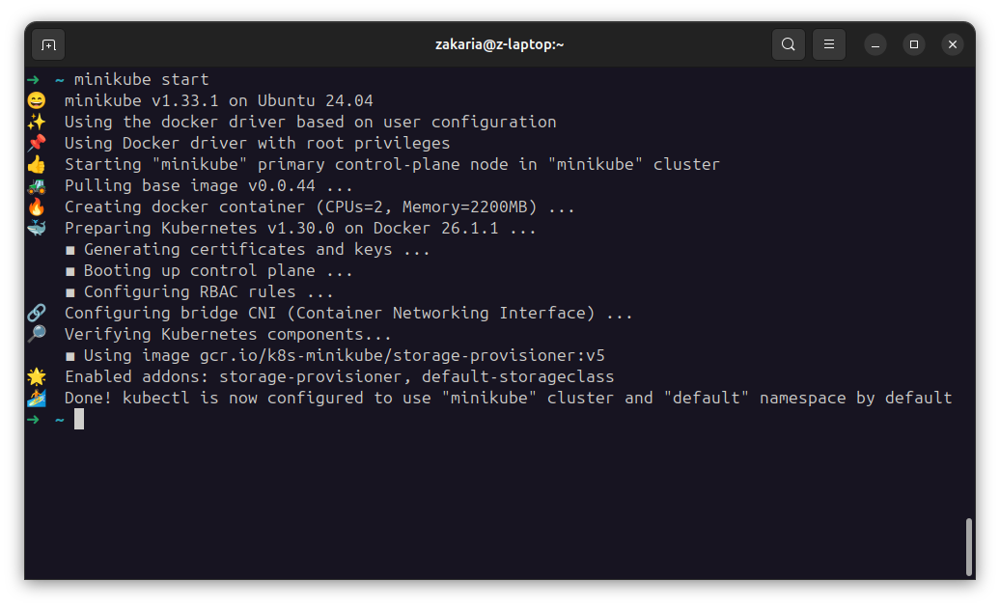

### 3. Deploy a Sample Application

- Deploy a simple web server application:
  
  ```bash
  kubectl create deployment hello-minikube --image=kicbase/echo-server:1.0
  ```

  This command creates a deployment named `hello-minikube` using the `echoserver` image.

  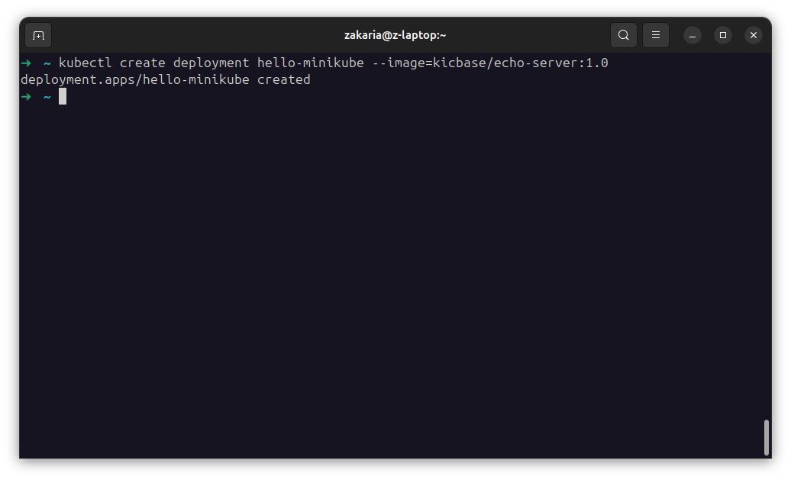

### 4. Expose and Access the Application

#### Using a Service

- Expose the deployment as a service to make it accessible:

  ```bash
  kubectl expose deployment hello-minikube --type=NodePort --port=8080
  ```

  This command creates a service of type `NodePort` that maps port 8080 of the service to a port on the node.

  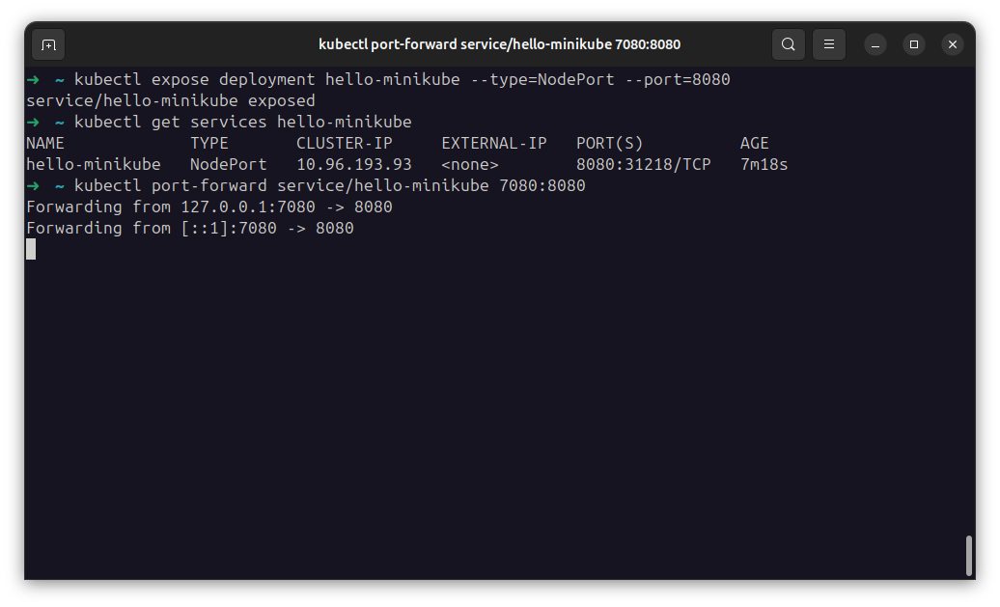

- Use kubectl to forward the port:

  ```bash
  kubectl port-forward service/hello-minikube 7080:8080
  ```

  This command forwards port 8080 of the service to port 7080 on your localhost, making the application accessible at [http://localhost:7080/](http://localhost:7080/).

  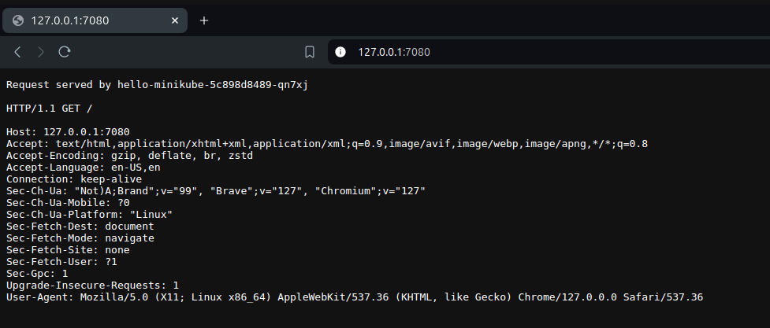

- Alternatively, get the URL to access the application:

  ```bash
  minikube service hello-minikube
  ```

  This command provides the URL where you can access the sample application running in your Minikube cluster.

  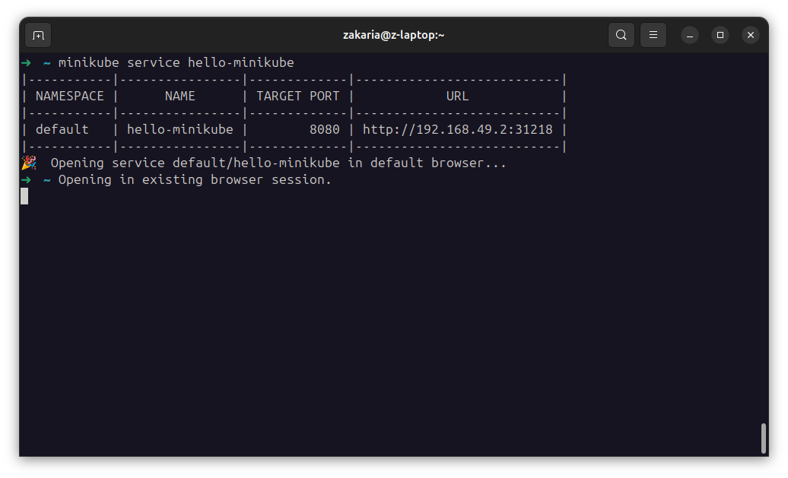
  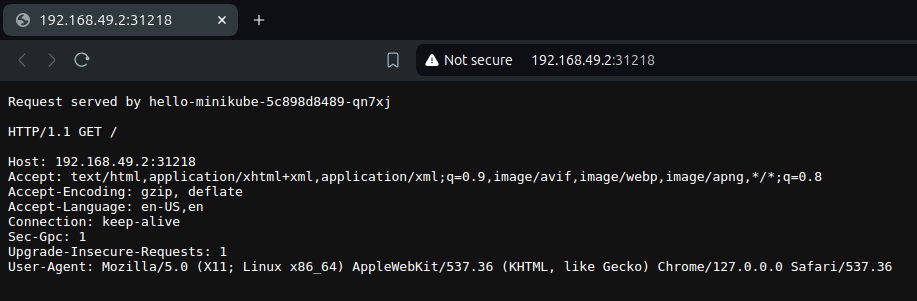

#### Using a LoadBalancer

- Create a deployment:

  ```bash
  kubectl create deployment balanced --image=kicbase/echo-server:1.0
  ```

  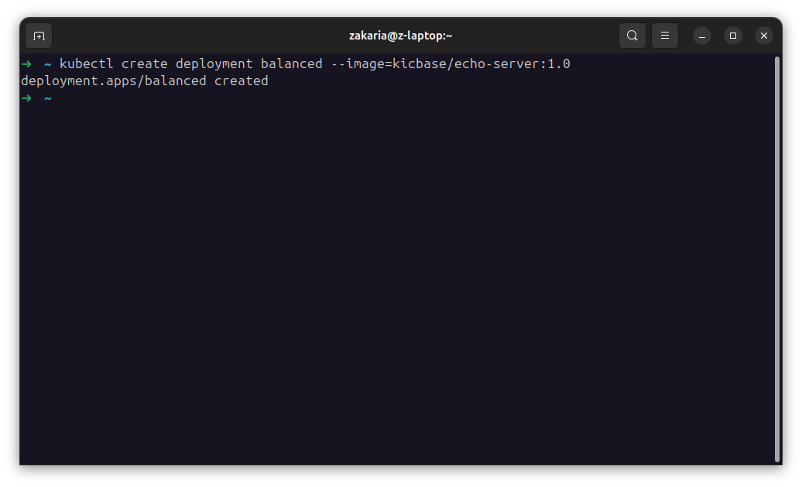

- Expose the deployment as a LoadBalancer service:

  ```bash
  kubectl expose deployment balanced --type=LoadBalancer --port=8080
  ```

  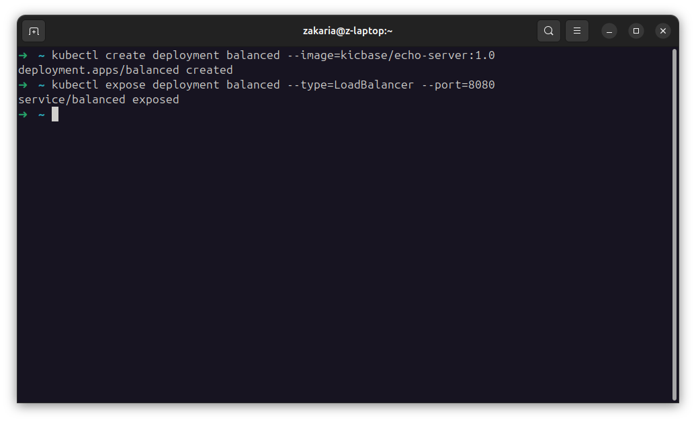

- Start the tunnel to create a routable IP for the 'balanced' deployment in another window:

  ```bash
  minikube tunnel
  ```

  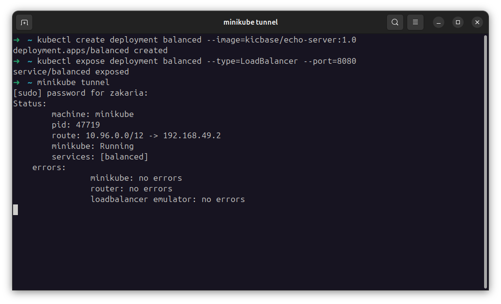

- Find the routable IP by running this command and examining the EXTERNAL-IP column:

  ```bash
  kubectl get services balanced
  ```

  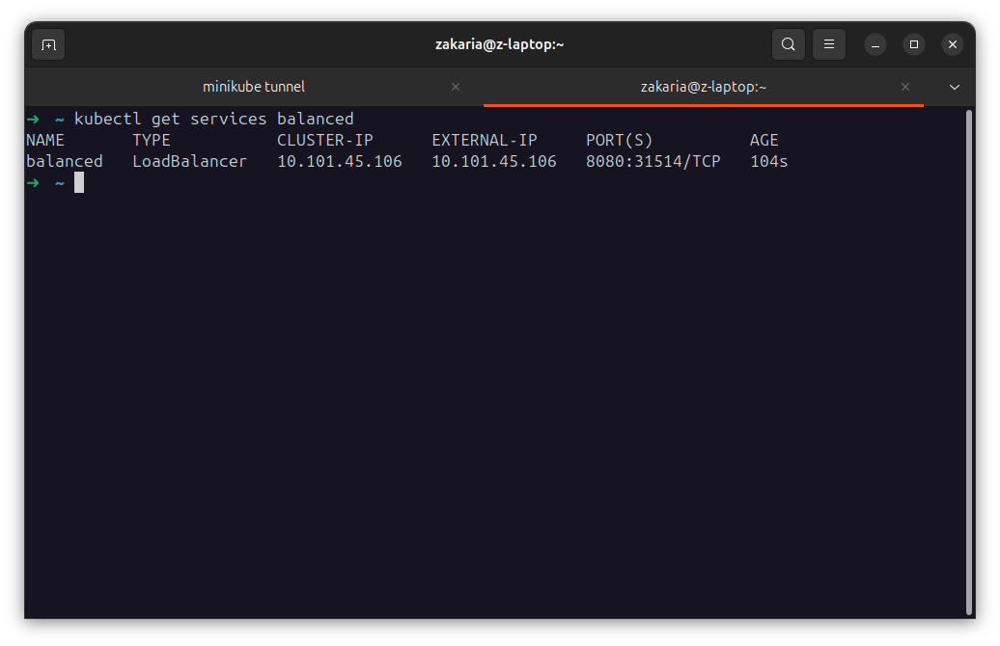
  
  Your deployment is now available at `10.101.45.106:8080`.

  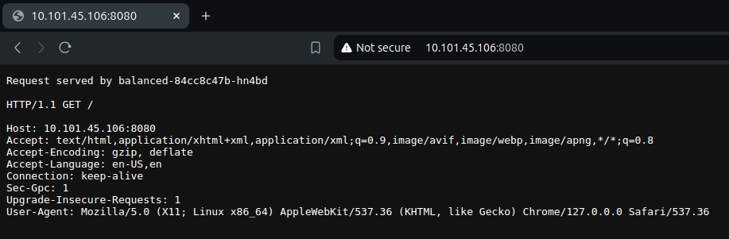

#### Using an Ingress

- Enable the ingress addon:

  ```bash
  minikube addons enable ingress
  ```

  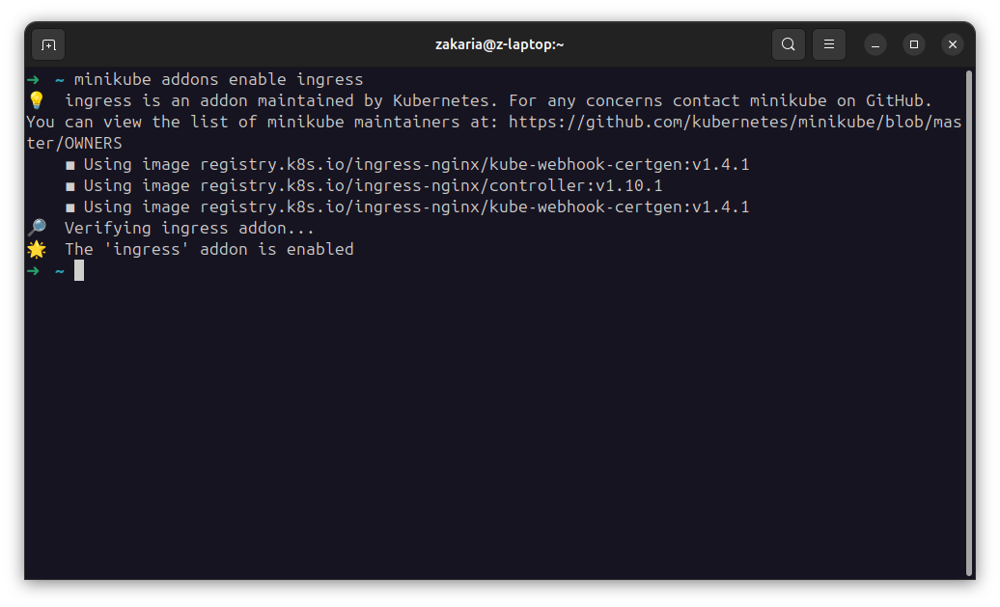

- Create an example deployment and service with Ingress:

##### Files

> - [foo-app.yaml](resources/foo-app.yaml)
> - [foo-service.yaml](resources/foo-service.yaml)
> - [bar-app.yaml](resources/bar-app.yaml)
> - [bar-service.yaml](resources/bar-service.yaml)
> - [ingress.yaml](resources/ingress.yaml)

- Apply the Ingress configuration:

  ```bash
  kubectl apply -f resources/foo-app.yaml
  kubectl apply -f resources/foo-service.yaml
  kubectl apply -f resources/bar-app.yaml
  kubectl apply -f resources/bar-service.yaml
  kubectl apply -f resources/ingress.yaml
  ```

  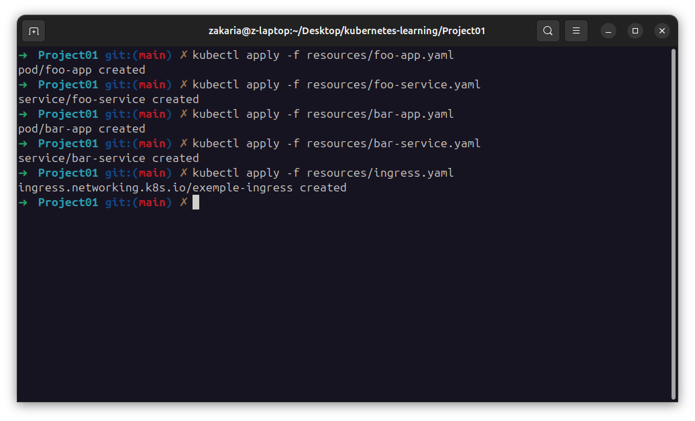

- Get the Minikube IP:

  ```bash
  minikube ip
  ```

- Access the application via the Ingress host configured in `ingress.yaml`.

  ```bash
  kubectl get ingress
  ```

  ```bash
  curl 192.168.49.2/foo
  # Output: Request served by foo-app
  
  curl 192.168.49.2/bar
  # Output: Request served by bar-app
  ```
  
  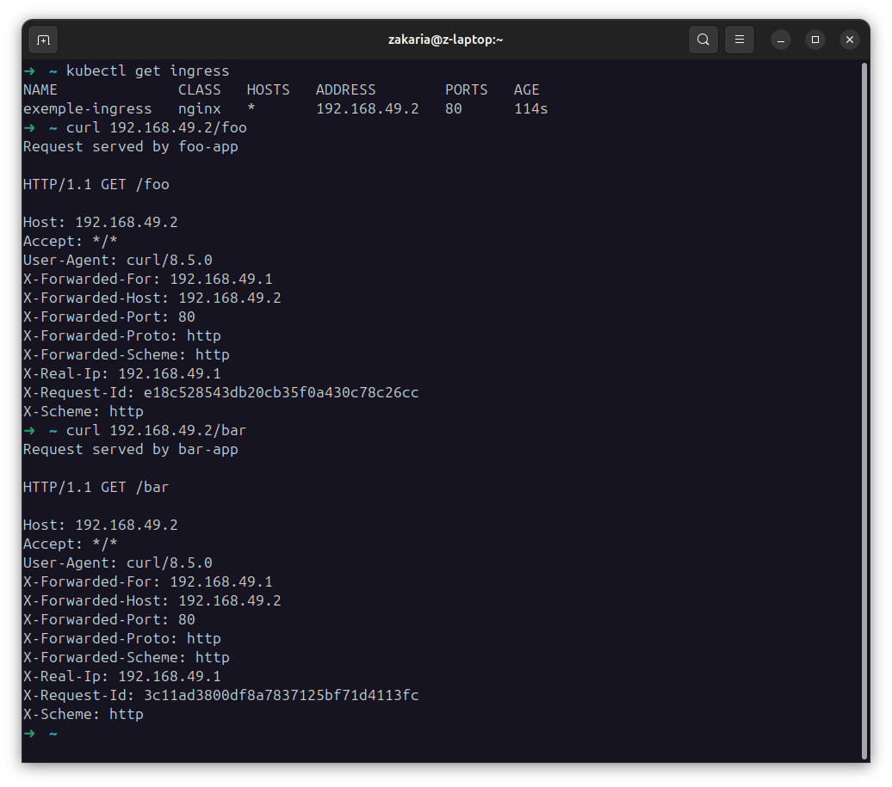

### 5. Scale the Application

- Scale the deployment to run multiple replicas:
  
  ```bash
  kubectl scale deployment hello-minikube --replicas=3
  ```

  This command scales the deployment to 3 replicas.

  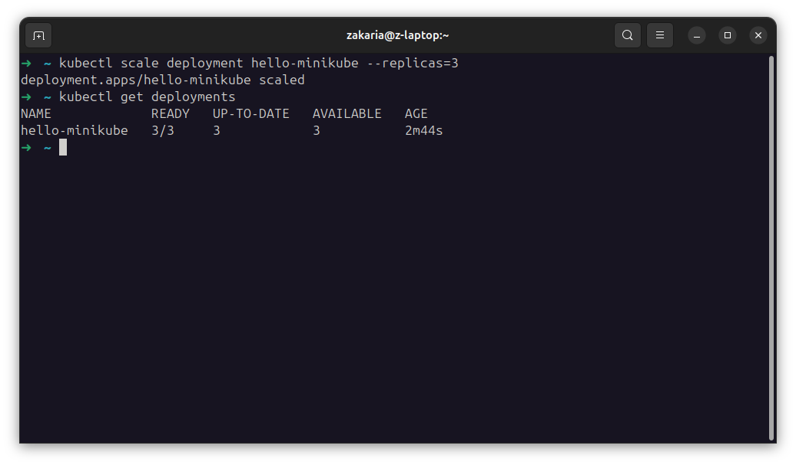

### 6. Perform a Rolling Update

- Update the deployment with a new image:
  
  ```bash
  kubectl set image deployment/hello-minikube echo-server=kicbase/echo-server:latest
  ```

  This command performs a rolling update to the deployment by changing the container image to `echo-server:latest`.

  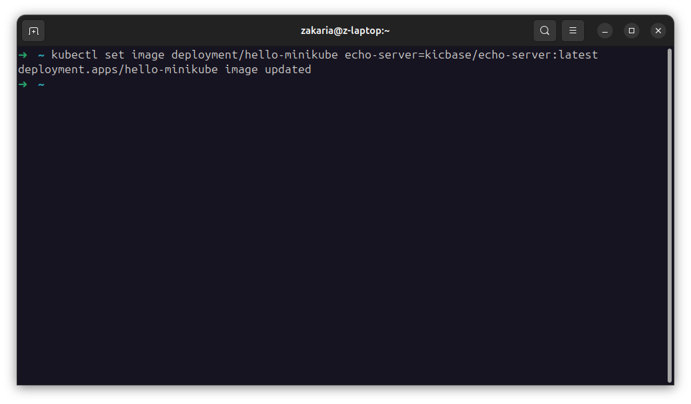

## Resources

- [Minikube Documentation](https://minikube.sigs.k8s.io/docs/)
- [Kubernetes Documentation](https://kubernetes.io/docs/home/)

---
